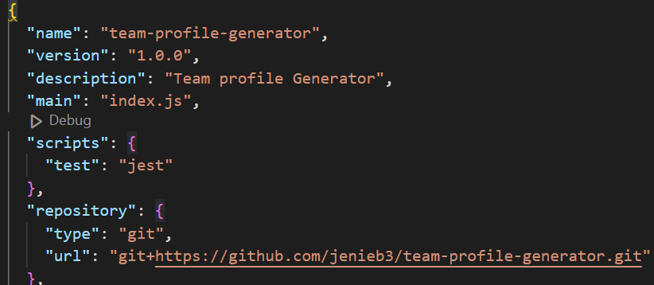
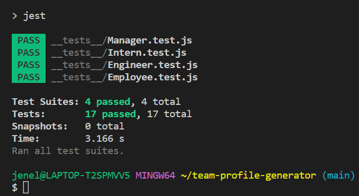
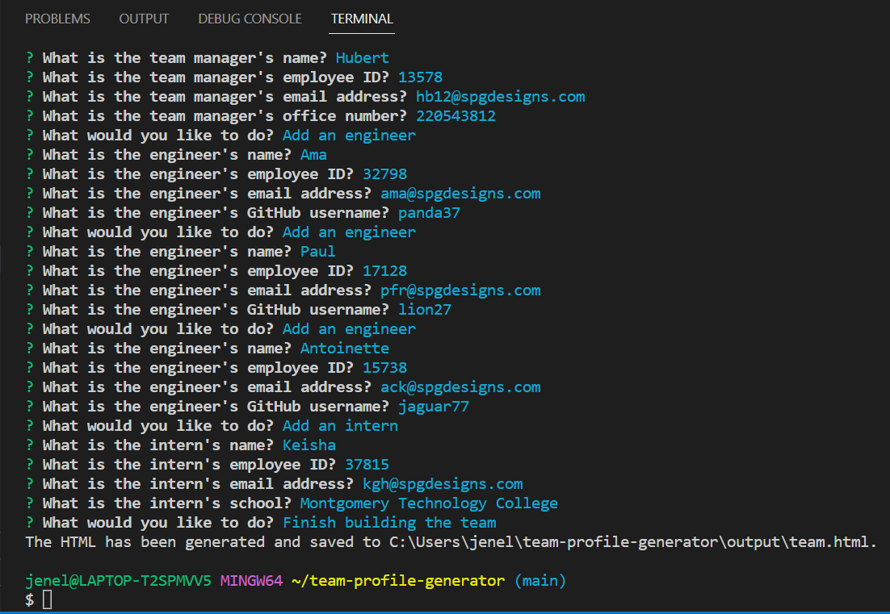
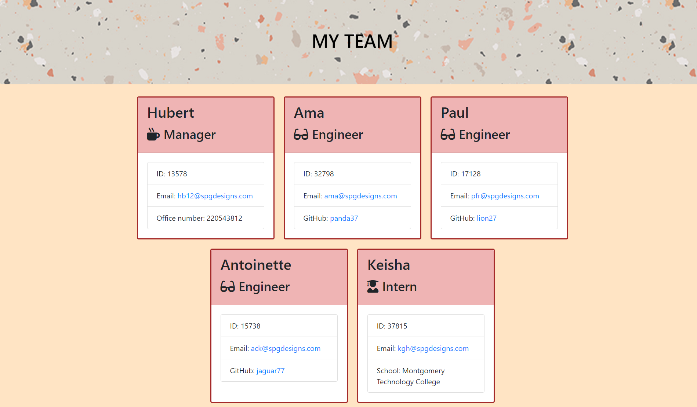

# Team Profile Generator

  
  
  ## Description

  This project uses npm inquirer package to dynamically generate a team profile. I found this project similar to the readme.md generator as users are propmted to input the required information for the different roles in the team. An HTML file is generated which can then be styled using CSS.
  ## Table of Contents

  - [Installation](#installation)
  - [Usage](#usage)
  - [License](#license)
  - [Contributing](#contributing)
  - [Tests](#tests)
  - [Questions](#questions)  

  ## Installation

  First node.js needs to be installed. Next run the npm command line npm init before coding. 

  ## Usage

  This Professional Team is great to display your organisation structure and makes the team more accessible. When the email address is clicked the user is presented with options to correspond with the default email address of the user. Similarily, when the github user name is clicked the user is taken to the GitHub page is displayed. 

  ## License

  This project is licensed under the MIT license.

  ## Contributing

  To contribute to my project, please fork the repository, make your changes on a separate branch, and submit a pull request. I'll review your changes as soon as possible!

  ## Tests
  To run the tests for my project, first install jest then simply run the npm test command. This will launch the test runner and display the results in your terminal. I have included a link to a short youTube video in the credits section to guide you.

  ## Credits

  I found this short video tutorial easy to understand and quite helpful. I takes you through the installation of jest and give you and understanding of how and why to do testing. https://www.youtube.com/watch?v=FgnxcUQ5vho&list=LL&index=1

  ## Questions
  For questions or support, please contact jenelle.garbrah3@gmail.com. To see other projects, visit https://github.com/jenieb3/.

  ## Screenshot
 
 
 
  

 ## Video
 [Team Generator Video Demo](https://drive.google.com/file/d/1TpNyNN9XvbGQpWGFOeMH3v_m8xdxIjao/view?usp=share_link)  